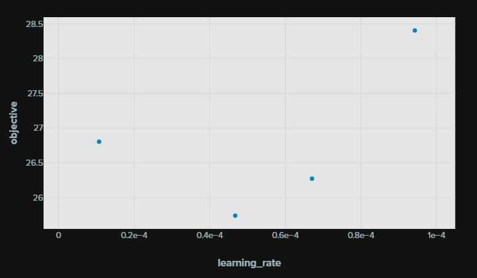

# Improving model performance
There are many ways one can try to improve the model performance, these can be broadly divided into two categories; model centric and data centric.

## Model centric

### Tune hyperparameters
One thing you can do to try and improve model performance is to adjust the hyperparameters, in our case the most significant hyperparameter to tweak is the learning rate. A too low of a learning rate means the model weights will converge slower so you have to train for longer for the same result. A too high of a learning rate might make the model weights miss their local optima values completely. We ran a few low step-experiments with different values of the learning rate in order to view how it might affect our model. Below are the results with the WER in % on the Y-axis and the learning rate hyperparameter on the X-axis.

There are other hyperparameters that can be tuned such as the dropout in order to reduce overfitting. However each experiment takes a lot of time and computing units on colab so we decided to only run experiments on the learning rate.

### Fine tuning model architecture
Another thing that can be done is to adjust the architecture of the model, we did not consider this an efficient alternative since the architecture of whisper-small is already quite sophisticated and retraining it with the new architecture is of course not feasible.

## Data centric

### Find new data sources
One thing that can be done is to look for better data sources that you can train your model on. We looked around for swedish datasets and found the NST dataset and a version was available on huggingface. In order to compare our model's performance with the NST data vs the Mozilla-Common-Voice data, we (TODO INSERT COMPARISON)

### Feature engineering
Another thing that can be done is change how the feature engineering is done in order to get a more information dense representation of the data. In our case this would mean changing the process in which the audio files are converted into log mel spectograms. Basic things like changing the length that we cut each file(30s at the moment) are within our reach but changing the core feature engineering process and make it better than the default one in whisper-small requires signal processing expertise that we do not have.

## Link to models
Mozzila: https://huggingface.co/fimster/whisper-small-sv-SE

NST:     https://huggingface.co/fimster/whisper-small-sv-SE-NST

# Gradio

The goal with our app was to showcase how AI, especially ASRs can be utilised for gameification – a hot topic for many diffirent industry sectors. A example is online language learing, schools working remote or in the context of an organisation Dualingo. We showcased this by creating a simple language learning app, where the user sees an image and is prompted to respond with the correct word for it. However, due to limitations, the app is very spartanic, but it works as a PoC.

Link to app: https://huggingface.co/spaces/antonbol/finetune_whisper
