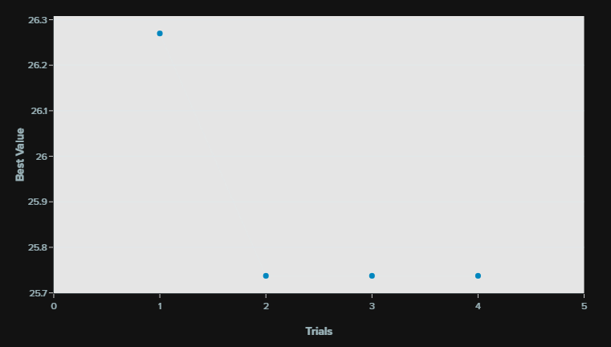

# Improving model performance
There are many ways one can try to improve the model performance

## Model centric

### Tune hyperparameters
One thing you can do to try and improve model performance is to adjust the hyperparameters 

### Fine tuning model architecture

## Data centric

### Find new data sources

### Feature engineering
