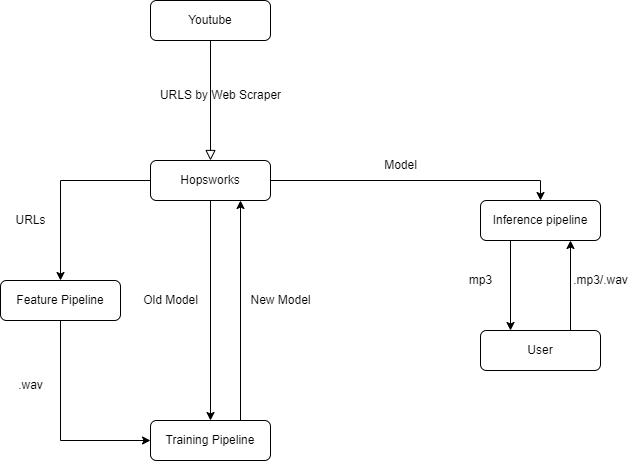

# Vocal Remover Architecture
We have built a scalable architecture for a model that takes as input a song file and returns the song with all vocals removed.

## INFRASTRUCTURE

The broad infrastructure of the system is illustrated in the below sketch.



The different parts of the system and their respective interfaces are described in the following sections.

## FEATURE PIPELINE (FP)

The feature pipeline contains functionality for converting youtube urls to .wav files, this is needed to train the model and can also be used to extend the inference pipeline to take youtube urls as input as well. We also had to do some pre-processing, trimming each song and corresponding instrumental so that they align in length.

Moreover, we also created an example of a more traditional feature pipeline called `feature-pipeline-weekly` which does all the CPU intensive pre processing (converting to arrays and the previously mentioned pre-processing) and uploads the files and relative paths to said file to hopsworks. This makes is easier when scaling the training pipeline.

## HOPSWORKS (HW)

We use hopsworks for storage of the scraped youtube URLs. Different versions of the model are also stored in HW. HW interfaces with TP by providing youtube urls for training and by receiving a newly trained model back. It also interfaces with IP by providing the model to be used for inference.

## INFERENCE PIPELINE (IP)

### CURRENT PIPELINE

Our inference pipeline is in the form of a gradio application hosted on Huggingface: https://huggingface.co/spaces/antonbol/vocal_remover, it takes a .waw/.mp3 song file as input, fetches a model from HW to use for inference, uses the pre-made interface for inference from the open source repo and returns a .wav file containing the song with the vocals removed.
### FURTHER IMPROVEMENTS
Further improvements could be to connect the FP to the IP so that the user can give a youtube URL as input as an alternative to providing an audio file. An additional improvent to this could be to make a batch inference pipeline that automatically performs inference on the new songs that are added into HW. The model would also have to be trained for considerably more time to function very well. Currently it retains some fragments of the vocals and the remocal is not complete.

## OPEN SOURCE MODEL

We use an open source model available at github: https://github.com/tsurumeso/vocal-remover. It provides pre made interfaces for training and inference that we use for our project. The training interface model takes as input .wav/.mp3 files split into mixtures(whole song) and instruments(rest) and an optional pretrained model to use as starting point for the training. The default of the training interface is to split the dataset into validation and training on it's own but there is also an option to use a presplit dataset split into validation and training, we use this latter option for our training pipeline so that we can use the same validation set to compare the performance of different model versions.

## DSD BASE DATASET

### DATASET

We used a base dataset for the training of our model. The DSD dataset is available here: https://sigsep.github.io/datasets/dsd100.html. It contains 100 songs split into the parts "mixture", "vocals", "bass", "drums", "other" in .wav-format. Mixture contains the whole song and the rest contain different separate parts of the song. This posed a problem for us since what we needed to train our model were two .wav/.mp3 files for each song, one for the whole song and one for all the other sounds of the song together. We therefore wrote a bash script that uses the command line tool for video/audio processing ffmpeg in order to combine the "bass", "drums" and "other" parts of each song into a single "instrumentals" part. We also needed bash scripts for renaming the .wav files since they were all named the same thing for each song, e.g all "mixture" files were called "mixture.wav" and placed into a folder that had the song name in it. We therefore wrotw another bash script that uses find in order to move and rename all the .wav files to using their song names such that they are all placed in the same folder for mixtures and instruments respectively since this was the folder structure required for the open source model we were using. Below are descriptions and snippets of the bash scripts.
We also split the dataset into 20 validation songs and 80 training songs such that we can compare different versions of the song on the same validation set.

### STORAGE

Since the base dataset is quite large and we are using the free memory-limited version of hopsworks, we store the dataset as a zipped file on google drive which we unzip and use in the training pipeline. The training pipeline is therefore most easily run in google colab for seamless integration with google drive.

### BASH SCRIPTS
#### ffmpeg amix script
```
#!/bin/bash -e
shopt -s globstar
# for every folder in currend working directory, run ffmpeg amix on the drums, bass and other files in that directory
for f in ./*/; do
    echo "$f"
    d="${f}drums.wav" 
    b="${f}bass.wav" 
    o="${f}other.wav" 
    ffmpeg -i "$d" -i "$b" -i "$o" -filter_complex amix=inputs=3:duration=first:dropout_transition=3 "${f}instrumentals.wav"    
done
```
#### Move and rename instrumentals, fm_mix.sh contains equivalent script for mixtures.
```
#!/bin/bash    
# Recursively finds all files named instrumentals.wav and moves them to working directory and
# renames them based on which top level folder they were found in
# example: in wd there is a folder called "001 - songname" and in this folder there is a file "instrumentals.wav"
# result: instrumentals.wav is moved to wd and named 001_inst.wav. The same search and move happens for all folders in wd
find . -type f -name *instrumentals.wav | while IFS= read -r f; do
    echo ${f:2:3}
    name=${f:2:3}
    #((++i))
    mv "$f" "./${name%.*}_inst.wav"
done
```


## TRAINING PIPELINE

Our training pipeline fetches the urls from HW that have been collected with the web scraper and combines them with the training songs from the DSD dataset. Then it fetches a model from hopsworks and runs the pre-made training command from the open source model to continue training the fetched pretrained model.

## WEB SCRAPER

To acquire a continues flow of data the first idea was to scrape [Billboard's hot 100](https://www.billboard.com/charts/hot-100/) to get the 100 hottest songs for the last weak. However, luckily we found an [API](https://github.com/guoguo12/billboard-charts) that already does this - so instead of doing the work twice we decided to use it instead. With the hottest 100 songs we now needed to get the actual audio files to be used in or machine. We first tried to find a database however non were free to use so instead we opted to use youtube music and download every song from the hot 100 with a corresponding instrumental version – which would be used for the ground truth.

## DATA MODEL on hopsworks

We utilised hopsworks for two feature groups. The first utilisation was when storing the scraped URLs to the songs and instrumentals, here we had the song and title as the key and the schema looks as follows.

| Artist | Title | Instrumental URL | Song URL | Diff | Time Stamp |
| ------ | ----- | ---------------- | -------- | ---- | ---------- |
| X      | Y     | A                | B        | C    | D          |

The Diff column is used so we can filter songs that are too diffirent in length (song vs instrumental) since we argue that in the future we could have devloped a better trimming function able to utilise pairs with a larger diff.

The Time Stamp column would be used for batch inference.

The second utilisation is for our proposed `feature-pipeline-weekly`, where the processed data is stored on hopsworks and the schema looks as follows:

| Artist | Title | Instrumental Path | Song Path | Coeff | Time Stamp |
| ------ | ----- | ----------------- | --------- | ----- | ---------- |
| X      | Y     | A                 | B         | C     | D          |

Here the paths are the path to each `.npy` file stored in the hopsworks file system.

The Coeff is a metric used during training.

The Time Stamp serves the same purpose as for the first table.
